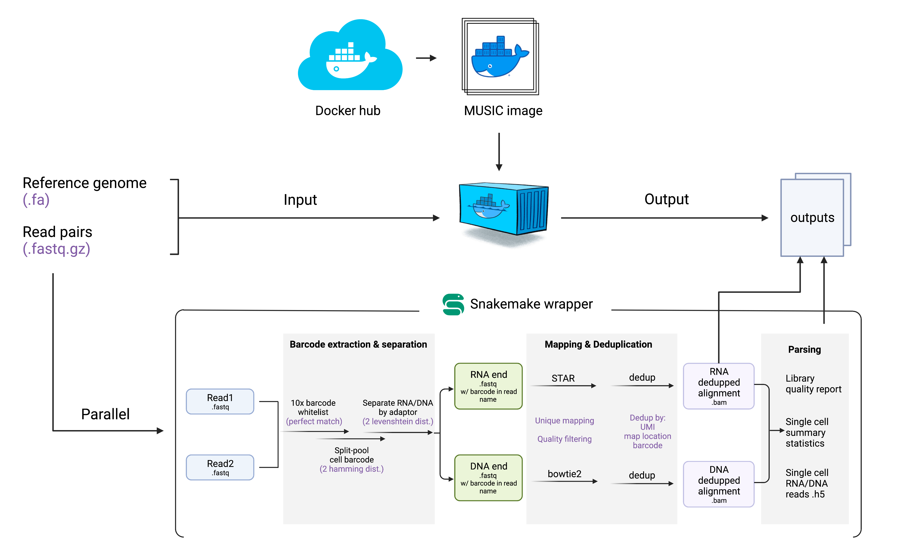

# Run MUSIC-tool pipeline in Docker

A comprehensive overview of data analyzing pipeline can be found at: http://sysbiocomp.ucsd.edu/public/wenxingzhao/MUSIC_docker/index.html 

## Overview

MUSIC-docker is a tool designed to provide a one-stop solution for processing MUSIC data. It is a docker image that wraps a Snakemake pipeline. MUSIC-docker combines the power of Docker and Snakemake to provide a one-stop solution for processing MUSIC data. It allows you to easily deploy and run the MUSIC pipeline in a reproducible and efficient way, making it easier to manage and automate the data processing process.



**Why we choose docker?**

Docker is a tool for packaging and deploying applications in lightweight containers. It allows you to package an application and its dependencies in a single container, making it easy to deploy and run on any platform. The philosophy behind Docker is to make it easier to create, deploy, and run applications by packaging them in containers. You can find more information about Docker and how to use it in the official Docker documentation at [https://docs.docker.com/](https://docs.docker.com/).


**Why we choose Snakemake?**

Snakemake is a workflow management system that allows you to define and run complex pipelines in a reproducible and efficient way. It is designed to be scalable, flexible, and easy to use, with a simple yet powerful syntax for defining workflows. The philosophy behind Snakemake is to provide a simple and intuitive way to define and run complex pipelines, making it easier to manage and automate complex workflow processes. You can find more information about Snakemake and how to use it in the official Snakemake documentation at [https://snakemake.readthedocs.io/](https://snakemake.readthedocs.io/).


## Install Docker on your system

If you don't have docker installed, please follow the instructions from docker docs: [https://docs.docker.com/engine/install/](https://docs.docker.com/engine/install/)


## Install MUSIC-docker image

MUSIC-tool has now been uploaded to docker cloud, which means you can install the container  by `docker pull` command:

```
docker pull irenexzwen/music_docker
```


## Run MUSIC-docker

### Data preparation

To run MUSIC-docker locally, we first need to prepare the following input files in a structured directory. The docker image (created from MUSIC-tool container) will run in an independent virtual enviornment. The only way for the image to communicate with your local file is through the `mount` command. Softwares running inside the docker image will recognize input files with the path inside the docker enviornment but not the file path on your local machine. So it is cruial to keep your input files in a structured directory and pass down parameters using relative path.

**Required input files:**

| File format | Description                                                                                                                                                                          | File name                                       |
| ----------- | ------------------------------------------------------------------------------------------------------------------------------------------------------------------------------------ | ----------------------------------------------- |
| .fastq.gz   | Input raw fastq files in gzipped format. Should have Read1 and Read2 files for 8 libs (Notice that the initial library is spliited into 8 aliqotes and using unique index before sequencing). | Not fixed, as long as it is in gzipped format.  |
| .json       | A JSON file to specify the name of each lib and the file path of corresponded R1, R2 files. Notice the file path should only use relative path to the JSON file. We recommend to put the samples.json file in the same folder as the 8 pairs of fastq.gz files                    | Required and fixed: samples.json                |
| .gtf        | gtf file of the reference genome of interest.                                                                                                                                        | Not fixed. File name pass in as parameters when use docker run.                                       |
| .fa         | fasta file of the reference genome of interest.                                                                                                                                      | Not fixed. File name pass in as parameters when use docker run.                |

On your local machine prepare a input folder structured as follows:

```
> tree local_path/MUSIC_input_folder/

├── data
│   ├── lib1_S1_R1_001.fastq.gz
│   ├── lib1_S1_R2_001.fastq.gz
│   ├── lib2_S2_R1_001.fastq.gz
│   ├── lib2_S2_R2_001.fastq.gz
│   ├── lib3_S3_R1_001.fastq.gz
│   ├── lib3_S3_R2_001.fastq.gz
│   ├── lib4_S4_R1_001.fastq.gz
│   ├── lib4_S4_R2_001.fastq.gz
│   ├── lib5_S5_R1_001.fastq.gz
│   ├── lib5_S5_R2_001.fastq.gz
│   ├── lib6_S6_R1_001.fastq.gz
│   ├── lib6_S6_R2_001.fastq.gz
│   ├── lib7_S7_R1_001.fastq.gz
│   ├── lib7_S7_R2_001.fastq.gz
│   ├── lib8_S8_R1_001.fastq.gz
│   ├── lib8_S8_R2_001.fastq.gz
│   └── samples.json
├── output
└── ref
    ├── gencode.v36.annotation.gtf
    └── hg38_genome.fa
```

> Notice that the output folder is necessary (even though it is empty right now), and it is the folder where your final output files will be located.


The samples.json file in our example will look like

```
// samples.json
{
  "lib1": {
    "Sample": "lib1",
    "R1": "lib1_S1_R1_001.fastq.gz", # path to R1 file.
    "R2": "lib1_S1_R2_001.fastq.gz"
  },
  "lib2": {
    "Sample": "lib2",
    "R1": "lib2_S2_R1_001.fastq.gz",
    "R2": "lib2_S2_R2_001.fastq.gz"
  },
  "lib3": {
    "Sample": "lib3",
    "R1": "lib3_S3_R1_001.fastq.gz",
    "R2": "lib3_S3_R2_001.fastq.gz"
  },
  "lib4": {
    "Sample": "lib4",
    "R1": "lib4_S4_R1_001.fastq.gz",
    "R2": "lib4_S4_R2_001.fastq.gz"
  },
  "lib5": {
    "Sample": "lib5",
    "R1": "lib5_S5_R1_001.fastq.gz",
    "R2": "lib5_S5_R2_001.fastq.gz"
  },
  "lib6": {
    "Sample": "lib6",
    "R1": "lib6_S6_R1_001.fastq.gz",
    "R2": "lib6_S6_R2_001.fastq.gz"
  },
  "lib7": {
    "Sample": "lib7",
    "R1": "lib7_S7_R1_001.fastq.gz",
    "R2": "lib7_S7_R2_001.fastq.gz"
  },
  "lib8": {
    "Sample": "lib8",
    "R1": "lib8_S8_R1_001.fastq.gz",
    "R2": "lib8_S8_R2_001.fastq.gz"
  }
}
```

These are all required input files for MUSIC-tool to run!

> **Alternative**: The pipeline is designed to automatically build bowtie2 and bwa references by default. However, if you prefer not to wait and wish to provide pre-built indices, follow these steps: 1. Create a folder named '/0_index/' under the '/output/' directory. 2. Place your pre-built index files in the created '/0_index/' folder, following the tree structure outlined below. Ensure that your index match the names in the specified tree structure to enable Snakemake to recognize these files. Two essential files, namely "bowtie2_index_done.txt" and "_bwa_index_done.txt," must be included. These files serve as checkmarks for Snakemake, indicating the completion of the index-building step before proceeding to the next stage. The content of these two .txt files can be anything you prefer.

```
├── output
│   ├── 0_index
│   │   ├── bowtie2
│   │   │   ├── bowtie2.1.bt2
│   │   │   ├── bowtie2.2.bt2
│   │   │   ├── bowtie2.3.bt2
│   │   │   ├── bowtie2.4.bt2
│   │   │   ├── bowtie2_index_done.txt
│   │   │   ├── bowtie2.rev.1.bt2
│   │   │   └── bowtie2.rev.2.bt2
│   │   └── BWA
│   │       ├── bwa_index.amb
│   │       ├── bwa_index.ann
│   │       ├── bwa_index.bwt
│   │       ├── _bwa_index_done.txt
│   │       ├── bwa_index.pac
│   │       └── bwa_index.sa
``` 

### Initiate the MUSIC-tool image

After all input files are ready, we are ready to initiate the pipelline with `docker run` command.

```
# download MUSIC-tool docker image:
docker pull irenexzwen/music_docker

# run the pipeline
docker run --rm \
        -v /local_path/MUSIC_input_folder/:/input \ 
        -v /local_path/MUSIC_input_folder/output/:/snakemake/outputs \ 
        music_docker:latest \
        --sample-json /input/data/samples.json \
        --num-jobs 20 \
        --fa /input/ref/hg38_genome.fa \
        --gtf /input/ref/gencode.v36.annotation.gtf \
        --uid `id -u` \
        --gid `id -g`
```

_Parameters explaination:_

* `--rm` : By default, when a container exits, it is not removed and can still be inspected and restarted using the `docker start` command. However, if the `--rm` flag is specified, the container will be automatically removed once it exits. This can be useful for cleaning up after a one-time task, as it ensures that the system does not accumulate stopped containers that are no longer needed.
* `-v`:  The `-v` flag is used with the `docker run` command to bind-mount a volume from the host system into a container. This allows you to share data between the host system and the container, or to persist data that is generated within the container beyond the lifetime of the container. the host path and the container path separated by a colon (`:`). In our command, we mount twice, the first one is `-v /local_path/MUSIC_input_folder/:/input` which mount the local input folder to folder `/input` in docker image. As you could see, later when we specify other parameters such as `-fa, -gtf` , we will use the new path that is in docker image as "/input/ref/\*\*.fa".  The second one is `-v /local_path/MUSIC_input_folder/out/:/snakemake/outputs` which is used to map docker produced output back to our local folder.
* `MUSIC:latest`: Before adding other customized parameters, we need to specify the image name, which is usually `name:tag`. The default tag is `latest`.
* `--sample-json`: Location of the samples.json file inside the docker, not local file path. No need to change the default if you structured your input folder as we suggested.
* `--num-jobs`: Threads for running the job. Snakemake will automatically distribute cpus to all jobs in a very efficient manner.
* `--fa`: Location of the reference genome fasta file inside the docker, not local file path. No need to change the default if you structured your input folder as we suggested.
* `--gtf`: Similar to `--fa`, but for location of the reference genome gtf file.
* `` --uid `id -u` ``:  No need to change this command. Here `` `id -u` ``will obtain your bowtie2 id on your local machine. This parameter is extremely crucial and it allows you (local bowtie2) to have permissions and ownership to all output files that produced by docker and Snakemake. Docker by default will create all files under `bowtie2 root` which is extremely inconvenient. However, the change of ownership from root to local bowtie2 will only be done after all output has finished. If your program is killed or stopped before finish the pipeline, the output file can still be owner by root.
* `` --gid `id -g` ``: No need to change this command. Here `` `id -g` ``will obtain your group id on your local machine.


## Output of MUSIC-docker pipeline

The output folder includes all intermediate files for bowtie2s to check and potential making use of. Briefly we have 6 major folder corresponds to each step.


| Output name         | Description                                                        | Major files within                                                                                                                                                                      |
| ------------------- | ------------------------------------------------------------------ | --------------------------------------------------------------------------------------------------------------------------------------------------------------------------------------- |
| /0\_index           | contains bowtie2 and STAR index.                                   | <ul><li>/0_index/bowtie2</li><li>/0_index/BWA</li></ul>                                                                                                                                |
| /1\_decode          | Demultiplexed and cleaned fastq files for DNA and RNA ends.        | <ul><li>lib\*_DNA(RNA)end_decode.fq (after demultiplexed)</li><li>lib\*_cutadap_trimed_DNA(RNA)end_decode.fq (adaptors, artifacts removed)</li><li>lib\*_stats.log</li></ul>               |
| /2\_DNAmapping      | Sorted uniquely mapped, mapq>20 DNA reads. Also mapping log file.  | <ul><li>bowtie2_mapq20_lib\*.sorted.bam</li><li>bowtie2_mapq20_lib*.stats.txt</li></ul>                                                                                                  |
| /3\_RNAmapping      | BWA RNA mapping results output folder                             | \lib*\ <ul><li>BWA_uniq_map_lib*.bam</li><li>BWA_uniq_map_lib*.bai</li></ul>                                                                                          |
| /4\_dedup           | Dedupped and sorted DNA and RNA uniquely mapped bam file.          | <ul><li>bowtie2_mapq20_lib\*.sorted.dedup.bam</li><li>RNA_BWA_uniq_map_lib*.sorted.dedup.bam</li></ul>                                                                                   |
| /5\_merge           | merged bam files from all libs.                                    | <ul><li>merge_DNA.sort.bam</li><li>merge_RNA.sort.bam</li></ul>                                                                                                                         |
| /6\_stats           | Cell and cluster size, DNA/RNA reads abundance statstitics.        | <ul><li>merge_DNA(RNA).sort.cell_clusters.csv</li><li>merge_DNA(RNA).sort.cell_reads.csv</li><li>merge_DNA(RNA).sort.clusters_size.csv</li><li>merge.sort.cluster_rna_dna.csv</li></ul> |


The full tree structure of the final output folder will look like:

```
> tree /local_path/MUSIC_input_folder/output/

.
├── 0_index
│   ├── bowtie2
│   │   ├── bowtie2.1.bt2
│   │   ├── bowtie2.2.bt2
│   │   ├── bowtie2.3.bt2
│   │   ├── bowtie2.4.bt2
│   │   ├── bowtie2_index_done.txt
│   │   ├── bowtie2.rev.1.bt2
│   │   └── bowtie2.rev.2.bt2
│   └── BWA
│       ├── bwa_index.amb
│       ├── bwa_index.ann
│       ├── bwa_index.bwt
│       ├── _bwa_index_done.txt
│       ├── bwa_index.pac
│       └── bwa_index.sa
├── 1_decode
│   ├── lib1_cutadap_trimed_DNAend_decode.fq
│   ├── lib1_cutadap_trimed_RNAend_decode.fq
│   ├── lib1_DNAend_decode.fq
│   ├── lib1_RNAend_decode.fq
│   ├── lib1_stats.log
│   ├── lib2_cutadap_trimed_DNAend_decode.fq
│   ├── lib2_cutadap_trimed_RNAend_decode.fq
│   ├── lib2_DNAend_decode.fq
│   ├── lib2_RNAend_decode.fq
│   ├── lib2_stats.log
│   ├── lib3_cutadap_trimed_DNAend_decode.fq
│   ├── lib3_cutadap_trimed_RNAend_decode.fq
│   ├── lib3_DNAend_decode.fq
│   ├── lib3_RNAend_decode.fq
│   ├── lib3_stats.log
│   ├── lib4_cutadap_trimed_DNAend_decode.fq
│   ├── lib4_cutadap_trimed_RNAend_decode.fq
│   ├── lib4_DNAend_decode.fq
│   ├── lib4_RNAend_decode.fq
│   ├── lib4_stats.log
│   ├── lib5_cutadap_trimed_DNAend_decode.fq
│   ├── lib5_cutadap_trimed_RNAend_decode.fq
│   ├── lib5_DNAend_decode.fq
│   ├── lib5_RNAend_decode.fq
│   ├── lib5_stats.log
│   ├── lib6_cutadap_trimed_DNAend_decode.fq
│   ├── lib6_cutadap_trimed_RNAend_decode.fq
│   ├── lib6_DNAend_decode.fq
│   ├── lib6_RNAend_decode.fq
│   ├── lib6_stats.log
│   ├── lib7_cutadap_trimed_DNAend_decode.fq
│   ├── lib7_cutadap_trimed_RNAend_decode.fq
│   ├── lib7_DNAend_decode.fq
│   ├── lib7_RNAend_decode.fq
│   ├── lib7_stats.log
│   ├── lib8_cutadap_trimed_DNAend_decode.fq
│   ├── lib8_cutadap_trimed_RNAend_decode.fq
│   ├── lib8_DNAend_decode.fq
│   ├── lib8_RNAend_decode.fq
│   └── lib8_stats.log
├── 2_DNAmapping
│   ├── bowtie2_mapq20_lib1.sorted.bam
│   ├── bowtie2_mapq20_lib1.stats.txt
│   ├── bowtie2_mapq20_lib2.sorted.bam
│   ├── bowtie2_mapq20_lib2.stats.txt
│   ├── bowtie2_mapq20_lib3.sorted.bam
│   ├── bowtie2_mapq20_lib3.stats.txt
│   ├── bowtie2_mapq20_lib4.sorted.bam
│   ├── bowtie2_mapq20_lib4.stats.txt
│   ├── bowtie2_mapq20_lib5.sorted.bam
│   ├── bowtie2_mapq20_lib5.stats.txt
│   ├── bowtie2_mapq20_lib6.sorted.bam
│   ├── bowtie2_mapq20_lib6.stats.txt
│   ├── bowtie2_mapq20_lib7.sorted.bam
│   ├── bowtie2_mapq20_lib7.stats.txt
│   ├── bowtie2_mapq20_lib8.sorted.bam
│   └── bowtie2_mapq20_lib8.stats.txt
├── 3_RNAmapping
│   ├── lib1
│   │   ├── BWA_uniq_map_lib1.bam
│   │   └── BWA_uniq_map_lib1.bam.bai
│   ├── lib2
│   │   ├── BWA_uniq_map_lib2.bam
│   │   └── BWA_uniq_map_lib2.bam.bai
│   ├── lib3
│   │   ├── BWA_uniq_map_lib3.bam
│   │   └── BWA_uniq_map_lib3.bam.bai
│   ├── lib4
│   │   ├── BWA_uniq_map_lib4.bam
│   │   └── BWA_uniq_map_lib4.bam.bai
│   ├── lib5
│   │   ├── BWA_uniq_map_lib5.bam
│   │   └── BWA_uniq_map_lib5.bam.bai
│   ├── lib6
│   │   ├── BWA_uniq_map_lib6.bam
│   │   └── BWA_uniq_map_lib6.bam.bai
│   ├── lib7
│   │   ├── BWA_uniq_map_lib7.bam
│   │   └── BWA_uniq_map_lib7.bam.bai
│   └── lib8
│       ├── BWA_uniq_map_lib8.bam
│       └── BWA_uniq_map_lib8.bam.bai
├── 4_dedup
│   ├── lib1
│   │   ├── bowtie2_mapq20_lib1.sorted.dedup.bam
│   │   └── RNA_BWA_uniq_map_lib1.sorted.dedup.bam
│   ├── lib2
│   │   ├── bowtie2_mapq20_lib2.sorted.dedup.bam
│   │   └── RNA_BWA_uniq_map_lib2.sorted.dedup.bam
│   ├── lib3
│   │   ├── bowtie2_mapq20_lib3.sorted.dedup.bam
│   │   └── RNA_BWA_uniq_map_lib3.sorted.dedup.bam
│   ├── lib4
│   │   ├── bowtie2_mapq20_lib4.sorted.dedup.bam
│   │   └── RNA_BWA_uniq_map_lib4.sorted.dedup.bam
│   ├── lib5
│   │   ├── bowtie2_mapq20_lib5.sorted.dedup.bam
│   │   └── RNA_BWA_uniq_map_lib5.sorted.dedup.bam
│   ├── lib6
│   │   ├── bowtie2_mapq20_lib6.sorted.dedup.bam
│   │   └── RNA_BWA_uniq_map_lib6.sorted.dedup.bam
│   ├── lib7
│   │   ├── bowtie2_mapq20_lib7.sorted.dedup.bam
│   │   └── RNA_BWA_uniq_map_lib7.sorted.dedup.bam
│   └── lib8
│       ├── bowtie2_mapq20_lib8.sorted.dedup.bam
│       └── RNA_BWA_uniq_map_lib8.sorted.dedup.bam
├── 5_merge
│   ├── merge_DNA.sort.bam
│   └── merge_RNA.sort.bam
└── 6_stats
    ├── cell_stats_done.txt
    ├── merge_DNA.sort.cell_clusters.csv
    ├── merge_DNA.sort.cell_reads.csv
    ├── merge_DNA.sort.clusters_size.csv
    ├── merge_RNA.sort.cell_clusters.csv
    ├── merge_RNA.sort.cell_reads.csv
    ├── merge_RNA.sort.clusters_size.csv
    └── merge.sort.cluster_rna_dna.csv
```

Shield: [![CC BY-NC-SA 4.0][cc-by-nc-sa-shield]][cc-by-nc-sa]

This work is licensed under a
[Creative Commons Attribution-NonCommercial-ShareAlike 4.0 International License][cc-by-nc-sa].

[![CC BY-NC-SA 4.0][cc-by-nc-sa-image]][cc-by-nc-sa]

[cc-by-nc-sa]: http://creativecommons.org/licenses/by-nc-sa/4.0/
[cc-by-nc-sa-image]: https://licensebuttons.net/l/by-nc-sa/4.0/88x31.png
[cc-by-nc-sa-shield]: https://img.shields.io/badge/License-CC%20BY--NC--SA%204.0-lightgrey.svg


