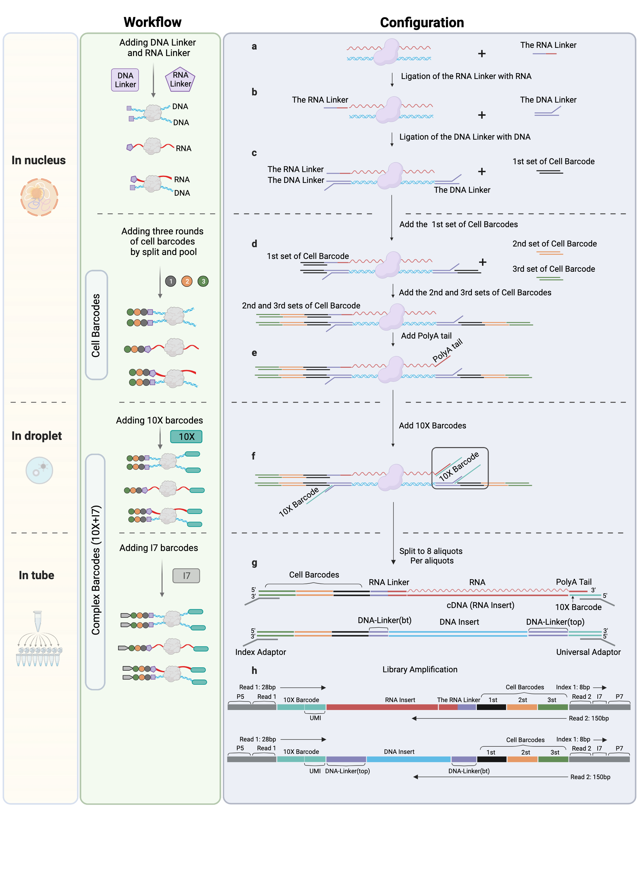

# MUSIC Introduction
## Motivation of the technology

Nucleus RNA is a vital component of the cell nucleus and plays a crucial role in genome organization and gene regulation. However, current technologies for profiling RNA-chromatin interactions can only be applied to large numbers of cells, which limits our understanding of cellular heterogeneity. By detecting RNA-DNA interactions at the single cell level, researchers can gain a deeper understanding of the unique regulatory landscape of nucleus RNA in individual cells and how it changes under different conditions. This is especially important in the study of complex tissues and disease states.

## Experimental design

The MUSIC method is a technique for capturing multiway nucleotide interactions within the nucleus at single cell resolution. Single cell resolution is achieved through three rounds of split-pool ligation with different DNA barcodes, resulting in 96^3 (884,7367) total combinations. Nucleotide interactions are captured through crosslinking and digestion, and RNA and DNA ends are differentiated and ligated using specialized linkers. Crosslinked molecular complexes are then physically separated and barcoded using the 10x droplet platform, with the complexes separated into numerous droplets, each containing one of 3.5 million barcodes. The final library is then split into 8 aliquots before sequencing to further improve the detection resolution at the single molecule level.

## Library configuration

The experimental protocols and sequencing library designs is described in the previous chapter.  The sequence configuration is illustrated in Figure2. We adopted a pair-end sequencing strategy. Read1 is 28bp which records 16bp 10x barcode and 12bp UMI sequences. Read2 is 150bp which records three cell barcodes, DNA/RNA Linker sequence and DNA/RNA insert sequence. Based on the design, RNA and DNA libraries can be pooled to be sequenced in the same run, and then be distinguished by the Linker sequence. We use the 19bp unique sequence (the leftmost 19bp before NNNNN) with up to 2 mismatches to select DNA molecules. The RNA linker has a 15bp unique sequence interspersed with 5bp random umi, where we use all 20bp to select RNA molecules by allowing at most 2 mismatches. 

